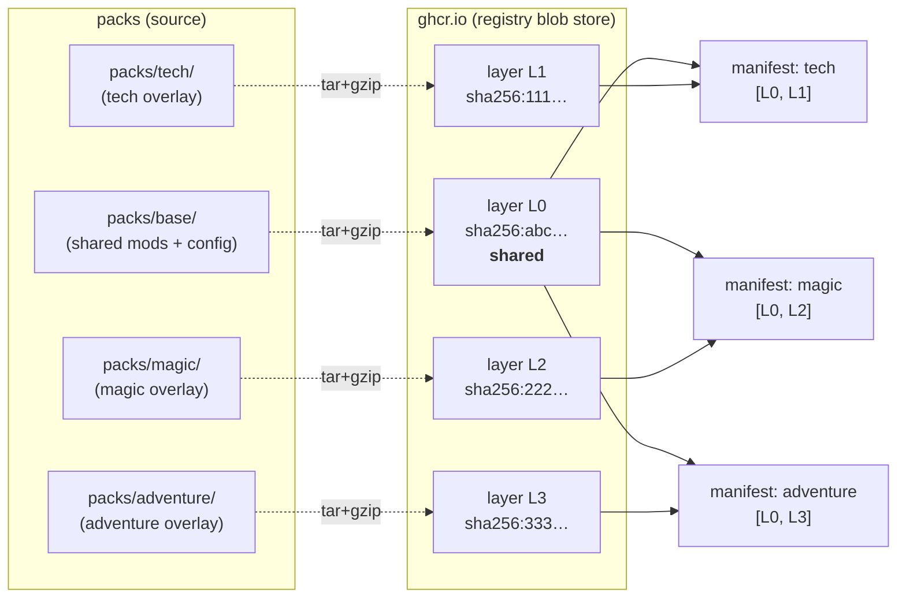
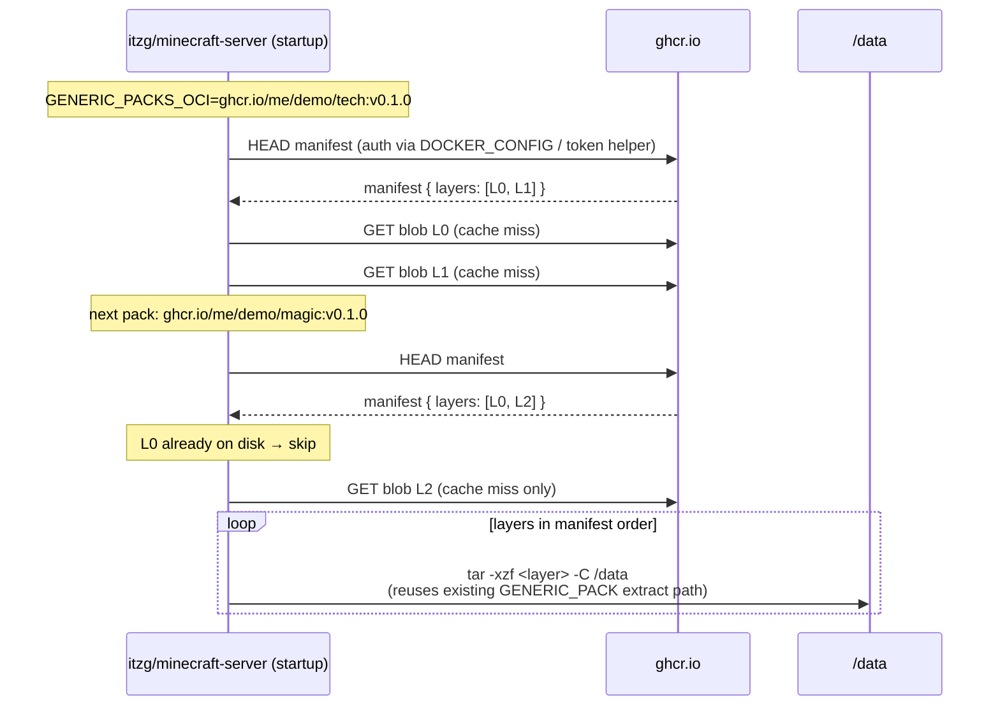

# oci-modpack-demo

A minimal reproduction repo for
[itzg/docker-minecraft-server#4038](https://github.com/itzg/docker-minecraft-server/issues/4038):
**ship Minecraft modpacks as OCI artifacts and consume them via
`GENERIC_PACKS`.**

The whole repo exists to demonstrate one property: when several packs share
a common base, an OCI registry stores the shared content **once** and clients
download it **once**, no matter how many sibling packs they pull.

> [!NOTE]
> The artifacts in this repo are intentionally tiny placeholders. The point
> isn't the content — it's the layer plumbing.

---

## Why OCI artifacts?

Today `GENERIC_PACK` / `GENERIC_PACKS` accepts a URL or a path to a `.zip` /
`.tgz` file ([docs][generic-packs]). That works, but every pack ships as a
single opaque blob; if three packs share 90% of their content there is no
deduplication on the wire or on disk.

OCI artifacts solve exactly this problem: a manifest references one or more
content-addressed layers, the registry stores each unique blob once, and the
client only downloads layers it doesn't already have. This is how container
images already work; OCI artifacts just relax the "must be a runnable image"
constraint.

[generic-packs]: https://docker-minecraft-server.readthedocs.io/en/latest/mods-and-plugins/#generic-pack-files

### The benefit, visualized



L0 is uploaded once, referenced by three manifests, downloaded once per
consumer regardless of how many packs they pull.

---

## Repo layout

```text
packs/
├── base/                # tar'd into L0 — shared by every pack
│   ├── config/
│   └── mods/
├── tech/                # tar'd into L1 — pack-specific overlay
│   ├── config/
│   └── mods/
├── magic/               # tar'd into L2
│   └── mods/
└── adventure/           # tar'd into L3
    └── mods/
scripts/
└── build-and-push.sh    # deterministic tar → oras push to $REGISTRY/<pack>:$TAG
examples/
└── consume/
    ├── pull-and-extract.sh   # reference flow for the consumer side
    └── docker-compose.yaml   # works against today's itzg/minecraft-server
.github/workflows/
└── publish.yaml         # CI: build + push all three packs to GHCR
mise.toml                # `oras`, `jq` versions + task shortcuts
```

---

## Build & push

Local:

```sh
mise install
oras login ghcr.io -u <you>          # one-time
REGISTRY=ghcr.io/<you>/oci-modpack-demo TAG=v0.1.0 ./scripts/build-and-push.sh
```

CI:
[`.github/workflows/publish.yaml`](.github/workflows/publish.yaml) runs the
same script on every push to `main` and on tag pushes. The job also asserts
that re-tarring `packs/base/` produces the same digest, so reuse stays
guaranteed across runs.

The script is deterministic by construction:

```sh
tar --sort=name --mtime='UTC 2020-01-01' \
    --owner=0 --group=0 --numeric-owner --format=ustar \
    -cf - -C packs/base . \
  | gzip -n > out/base.tar.gz
```

Stable file order, fixed mtime/owner/group, no gzip header timestamp →
byte-identical tarball → byte-identical sha256 → registry deduplication.

---

## Verifying layer reuse

After pushing, fetch each manifest and look at the first layer's digest:

```sh
for pack in tech magic adventure; do
  echo "=== ${pack} ==="
  oras manifest fetch ghcr.io/<you>/oci-modpack-demo/${pack}:v0.1.0 \
    | jq '.layers[] | {digest, size}'
done
```

You should see the same `sha256:…` for the first layer in all three
manifests, with different second-layer digests. That's the demo.

---

## Consumer side: how `docker-minecraft-server` could integrate



The two pieces of new behavior on the docker-minecraft-server side:

1. **Recognize an OCI ref.** A new env var (e.g. `GENERIC_PACKS_OCI`,
   accepting comma/newline-separated refs) or a new URL scheme on the
   existing `GENERIC_PACKS` (e.g. `oci://ghcr.io/me/demo/tech:v0.1.0`).
2. **Fetch + walk layers.** Either shell out to `oras` / `crane` (small
   static binaries) or implement a lightweight pull in
   [`mc-image-helper`][helper]. Each pulled layer is just a tar.gz, which
   the existing `GENERIC_PACK` code already knows how to extract — including
   the env-var interpolation, `SYNC_SKIP_NEWER_IN_DESTINATION`, and
   `REMOVE_OLD_MODS` semantics.

`examples/consume/pull-and-extract.sh` is a reference implementation in
~60 lines of bash. `examples/consume/docker-compose.yaml` shows the same
flow today via an `oci-init` sidecar that runs against an unmodified
`itzg/minecraft-server`.

[helper]: https://github.com/itzg/mc-image-helper

### Suggested env-var shape

| Variable | Example | Notes |
| --- | --- | --- |
| `GENERIC_PACKS_OCI` | `ghcr.io/me/demo/tech:v0.1.0,ghcr.io/me/demo/extras:v0.1.0` | Comma- or newline-separated refs. Layers are applied in declared ref order; within a ref, in manifest layer order. |
| `GENERIC_PACKS_OCI_AUTH_FILE` | `/run/secrets/docker-config.json` | Standard Docker auth file path, lets users reuse `docker login` / `oras login` credentials without exposing them in env. |
| `GENERIC_PACKS_OCI_PLATFORM` | `linux/amd64` | Defaults fine for tar.gz artifacts (no platform discrimination); reserved for future per-arch packs. |

Existing `GENERIC_PACK*` knobs (`SKIP_GENERIC_PACK_UPDATE_CHECK`,
`FORCE_GENERIC_PACK_UPDATE`, `GENERIC_PACKS_DISABLE_MODS`, etc.) keep their
semantics.

---

## Wider benefits beyond layer reuse

- **Content-addressed by digest** — `…@sha256:…` refs make pack pinning
  trivially verifiable; no separate checksum env var needed.
- **Cosign / Sigstore signing** — same toolchain that signs container
  images works on artifacts; downstream operators can require signatures.
- **Standard auth** — `oras login` / `~/.docker/config.json` works for
  GHCR, Harbor, ECR, GCR, Artifactory, anything OCI-compliant.
- **Mirroring** — registries are designed for replication; large server
  fleets can mirror packs into a private registry without touching
  modpack-author CDNs.
- **Garbage collection** — OCI registries already know how to GC unreferenced
  blobs, so retiring an old pack tag actually frees the storage.

---

## Where to go next

If this approach looks reasonable I'd be happy to follow up with a concrete
patch against [`mc-image-helper`][helper] that adds an `apply-oci-pack`
subcommand wrapping `oras pull` + tar extraction, plus the env-var glue in
[docker-minecraft-server][dms] itself.

[dms]: https://github.com/itzg/docker-minecraft-server
